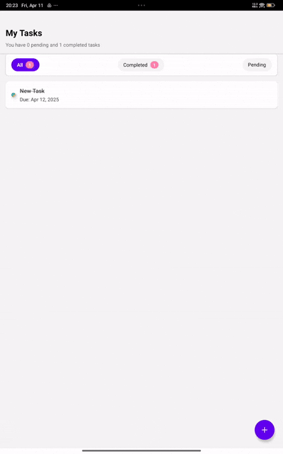

# ToDo Manager

A simple yet robust task management app built with React Native and Expo, demonstrating core mobile development skills, state management, local persistence, and polished UI.

---

## Architecture & Approach

- **File-based Routing** via **Expo Router** (`app/` directory) for intuitive navigation and dynamic routes (`[id].tsx`).
- **State Management** with **Zustand**: lightweight, minimal boilerplate, with actions for loading, adding, updating, and deleting tasks.
- **Persistence** using **AsyncStorage**: tasks are saved locally under the key `TASKS` and reloaded on app start.
- **Styling & Theming** through **styled-components**: centralized theme (`theme.ts`) with TypeScript augmentation (`styled.d.ts`) for full type safety.
- **Gesture Handling** using **react-native-gesture-handler**: swipe-to-delete implemented via `Swipeable`, wrapped in a `GestureHandlerRootView` in the root layout.
- **TypeScript** for static typing, interfaces (`src/types.ts`), and safer code.
- **Optimizations**:
  - `FlatList` tuned with `getItemLayout`, `initialNumToRender`, `windowSize`, and memoized `renderItem`/`keyExtractor` to ensure smooth scrolling.
  - Theming augmentation to eliminate TypeScript errors on `props.theme.colors`.

---

## Setup Instructions

1. **Clone the repository**

   ```bash
   git clone https://github.com/HarbingerOfTheEnd/ToDoManager.git
   cd ToDoManager
   ```

2. **Install dependencies**

   ```bash
   # If using npm
   npm install

   # If using yarn
   yarn install

   # If using pnpm
   pnpm install

   # If using bun
   bun install
   ```

3. **Run the app**

   ```bash
   # If using npm
   npm run start

   # If using yarn
   yarn run start

   # If using pnpm
   pnpm run start

   # If using bun
   bun run start
   ```

   - Press `i` to launch on iOS simulator
   - Press `a` to launch on Android emulator

4. **Build for devices** (optional)

   ```bash
   expo run:ios
   expo run:android
   ```

> Ensure you have Xcode (iOS) or Android Studio (Android) set up, and Expo CLI installed globally (`npm install -g expo-cli`).

---

## Completed Features

- **Login Screen** with dummy authentication (non-empty username/password).
- **Home Screen** listing tasks, with **filter** options: All / Completed / Pending.
- **Add/Edit Task** screen:
  - Create new tasks or edit existing ones.
  - Mandatory title, optional description.
  - Due date picker (styled control).
  - Completed status toggle.
- **CRUD Operations**: Create, Read, Update, Delete tasks.
- **Local Persistence** via AsyncStorage.
- **Empty State** view when no tasks exist.
- **Swipe-to-Delete** gestures for individual tasks.
- **Due Date Validation**: only future dates selectable.
- **404 Fallback** screen for unmatched routes.

---

## Bonus Features

- **Theming** with `styled-components` and TypeScript augmentation for `DefaultTheme`.
- **FlatList Performance**: `getItemLayout`, `initialNumToRender`, `windowSize`, `removeClippedSubviews`, and memoized callbacks.
- **TypeScript Config**: strict settings, module resolution, and no-emit to keep code clean.
- **404 Page** (`app/+not-found.tsx`) with custom styling and navigation back to home.
- **Improved Date Selector**: styled button and validation logic.

---

## Screenshots / GIFs

| Screen               | Preview                                  |
| -------------------- | ---------------------------------------- |
| Login Screen         |                |
| Home Screen          |                  |
| Add Task             |          |
| Swipe to Delete      |  |
| 404 Page             |                    |

---
